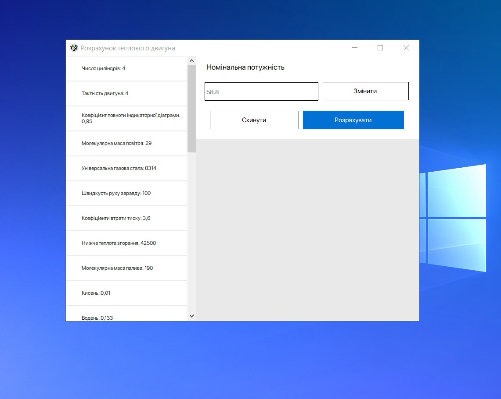
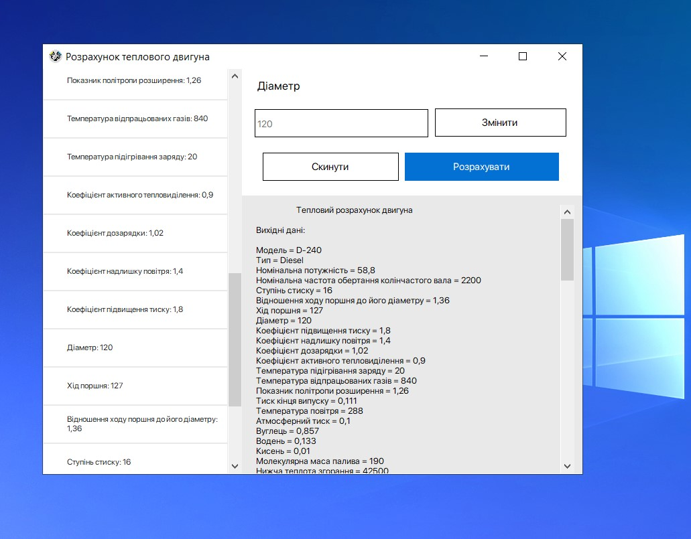

# Thermal_Engine_Calculation_On_CS

Calculation of heat engine indicators.  

The program was written for the Department of tractors and cars of Vinnitsa National Agrarian University.

- This program is written with WinForms (C# GUI)

#### The view:

A video demonstrating the operation of the program has been added to the repository "Демонстрація роботи калькулятора.mp4".

#### A video demonstrating the operation of the program:

https://user-images.githubusercontent.com/59102842/209549102-6bb00c65-38e3-4061-b02a-d98cb8f93364.mp4

